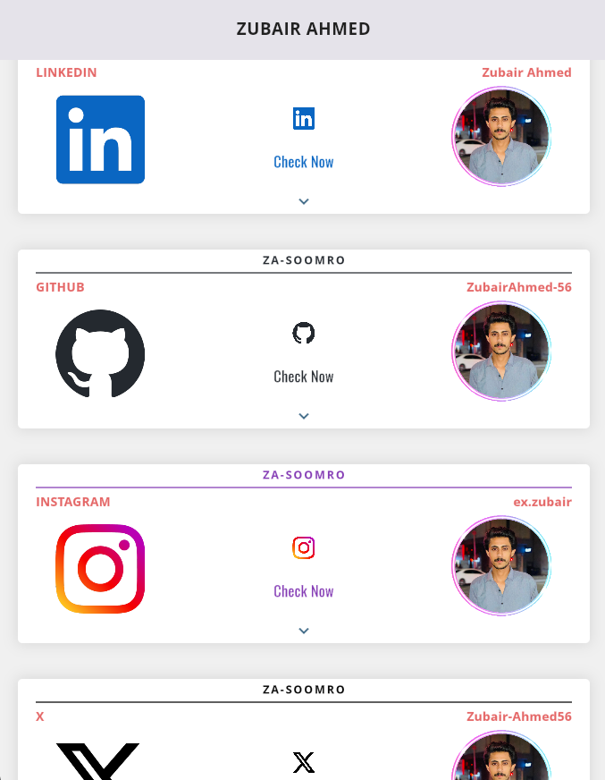
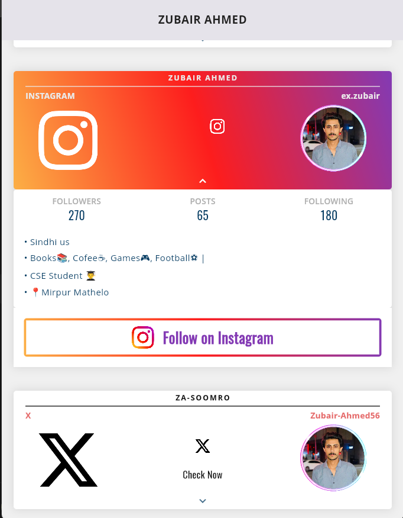
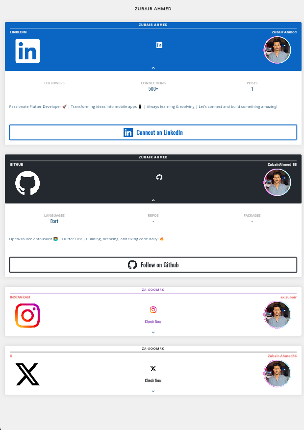

# TouchFolio

An interactive social profile card with flipping animation, built using Flutter Web.

## 🚀 Features
- Splash Screen – Smooth intro animation
- Social Cards View – Displays your connected social media accounts
- Flip Animation – Tap to flip open like a book page
- Follower Count – Live followers display for each account
- Responsive UI – Works seamlessly on multiple devices

If you like this project, give it a ⭐ on GitHub and connect with me
- GitHub : https://github.com/ZubairAhmed-56
- LinkedIn : https://www.linkedin.com/in/zubairahmed56/

📌 **Note:**  
This repository only contains compiled build files from the project.  
The original source code is private and not shared publicly.                                                                                                                                                         
For Code, contact the author.

## 📸 Screenshots

  
  
  
  

